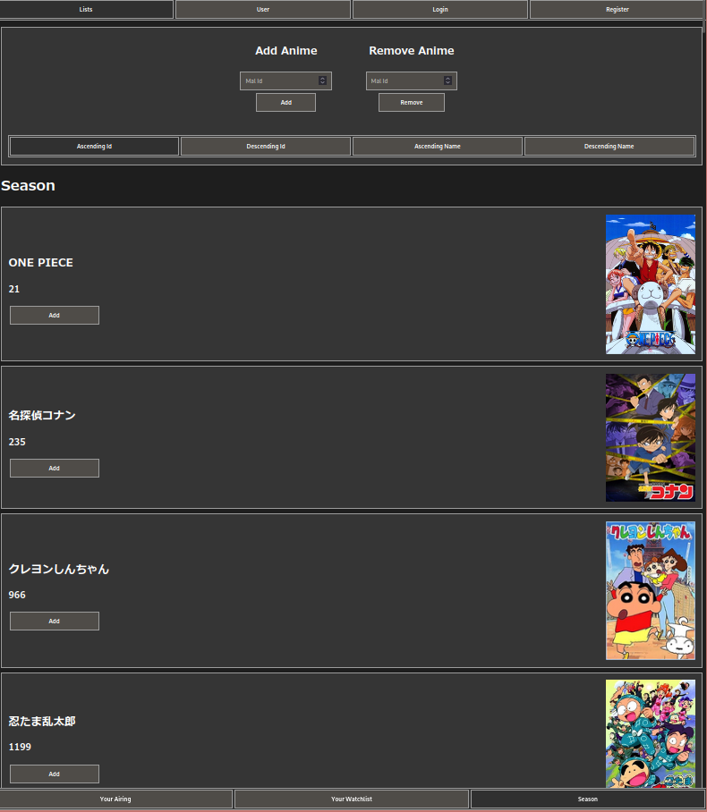

<h1 align="left">Seasonal Anime Episode Watchlist and Daily Airing Web Scaper</h1>
<https://ganime.kainoagardner.xyz/>


Anime Ids are based of MAL API
<https://myanimelist.net>

<h2>Terminal Commands</h2>
<h3>List Anime -l</h3>

#### Options 
>
> - today, t  //user's today airing
> - watchlist wl  //user's watchlist
> - all a //seasonal list

<h3>Example</h3>

```shell
foo@bar: getAnime -l t
---Watchlist Airing Today---
1 ID: 21 One Piece
2 ID: 235 Meitantei Conan
```

<h3>Add Anime -a</h3>
<p>Use Mal Id to add anime through website or terminal</p>
<h3>Example</h3>

```shell
foo@bar: getAnime -a 21
---Adding---
1 ID: 21 One Piece
```


